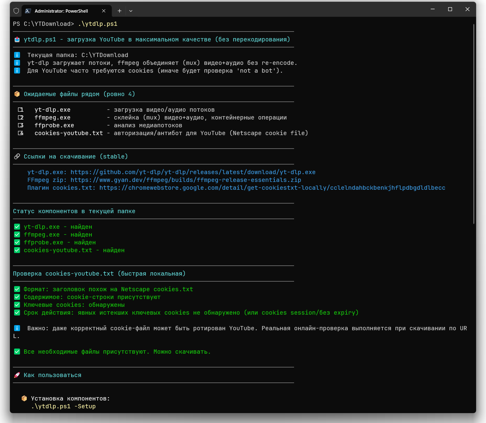
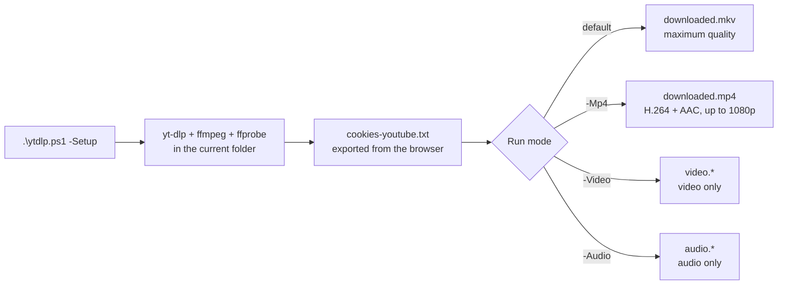

<div align="center">

# 📥 YTDownload

**Download YouTube videos in maximum quality with a single PowerShell script**

[](https://github.com/PowerShell/PowerShell)
[](https://github.com/bivlked/YTDownload/releases/latest)
[](https://github.com/bivlked/YTDownload/releases)
[](LICENSE)
[](https://www.microsoft.com/windows)

[Русский](README.md) | **English**



</div>

A single script, `ytdlp.ps1`, downloads the best available video and audio streams via [yt-dlp](https://github.com/yt-dlp/yt-dlp), merges them with [ffmpeg](https://ffmpeg.org/) without re-encoding, and installs all components by itself. Nothing is installed system-wide: everything lives in one folder.

> The script's console output is in Russian. Commands, flags, and behavior are fully described below in English.

## 📑 Table of Contents

- [Features](#-features)
- [Requirements](#-requirements)
- [Quick Start](#-quick-start)
- [How It Works](#-how-it-works)
- [Modes](#-modes)
- [Exit Codes](#-exit-codes)
- [Supported URLs](#-supported-urls)
- [Pre-download Checks](#-pre-download-checks)
- [Updating Components](#-updating-components)
- [FAQ](#-faq)
- [Troubleshooting](#%EF%B8%8F-troubleshooting)
- [File Layout](#-file-layout)
- [Technical Details](#%EF%B8%8F-technical-details)
- [Security](#-security)
- [Contributing](#-contributing)
- [License](#-license)

## ✨ Features

- ✅ **Maximum quality** - best available video and audio streams (VP9/AV1 + Opus, including 4K and 8K) with no re-encoding
- 🚀 **Automatic setup** - `-Setup` downloads yt-dlp, ffmpeg, and ffprobe with one command
- 🔒 **Safe by design** - works only in the current folder, never touches the system, isolated from external configs
- 🎯 **Simple** - one file; the only system dependency is PowerShell 7.2+
- 📦 **Portable** - move the whole installation by copying the folder
- 🍪 **Cookie support** - bypasses YouTube's "not a bot" checks
- ⚡ **Smart checks** - URL validation and cookie health checks before any download starts
- 🎨 **Clear output** - colored messages with actionable diagnostics and hints

## 📋 Requirements

- **Windows 10/11**
- **PowerShell 7.2+** ([download](https://github.com/PowerShell/PowerShell/releases/latest))
- **cookies-youtube.txt** - a cookie file for authorization (see [Step 2](#-step-2-set-up-cookies))

The yt-dlp, ffmpeg, and ffprobe components are downloaded automatically by the script.

## 🚀 Quick Start

**TL;DR for the experienced:** download the script, unblock it, run Setup, add cookies:

```powershell
Unblock-File .\ytdlp.ps1
.\ytdlp.ps1 -Setup
# + add cookies-youtube.txt (see Step 2)
.\ytdlp.ps1 "https://youtube.com/watch?v=VIDEO_ID"
```

---

### 📦 Step 1: Download and install

<details>
<summary>Need PowerShell 7? Check your version...</summary>

Open PowerShell and run:

```powershell
$PSVersionTable.PSVersion
```

If the version is below 7.2, [download PowerShell 7](https://github.com/PowerShell/PowerShell/releases/latest) (the `PowerShell-7.x.x-win-x64.msi` file).

</details>

**1.** [📥 **Download ytdlp.ps1**](https://github.com/bivlked/YTDownload/releases/latest/download/ytdlp.ps1) into a new folder (for example, `C:\YTDownload\`)

**2.** Open **PowerShell 7** and run:

```powershell
cd C:\YTDownload
Unblock-File .\ytdlp.ps1
.\ytdlp.ps1 -Setup
```

The script downloads yt-dlp, ffmpeg, and ffprobe automatically.

<details>
<summary>❓ "Not digitally signed" or "scripts is disabled" error?</summary>

Windows blocks scripts downloaded from the internet. Fix:

```powershell
# Option 1: Unblock the file
Unblock-File .\ytdlp.ps1

# Option 2: Via GUI
# Right-click the file -> Properties -> ☑ Unblock -> OK

# Option 3: Allow scripts for the current session
Set-ExecutionPolicy Bypass -Scope Process
```

</details>

---

### 🍪 Step 2: Set up cookies

> ⚠️ **Cookies are required** - the script will not start a download without `cookies-youtube.txt`.

| Step | Action |
|:---:|--------|
| 1️⃣ | Install the [Get cookies.txt LOCALLY](https://chromewebstore.google.com/detail/get-cookiestxt-locally/cclelndahbckbenkjhflpdbgdldlbecc) extension |
| 2️⃣ | Open an **InPrivate/Incognito** window and sign in to YouTube |
| 3️⃣ | Navigate to `youtube.com/robots.txt` and export the cookies |
| 4️⃣ | Save as `cookies-youtube.txt` in the script's folder |
| 5️⃣ | **Close the InPrivate window immediately** (important!) |

<details>
<summary>🔄 Cookies stopped working?</summary>

YouTube rotates cookies periodically. Just repeat steps 2-5 above.
Key point: export from `youtube.com/robots.txt`, not from the main page.

</details>

---

### 🎬 Step 3: Download!

```powershell
# Video + audio in maximum quality
.\ytdlp.ps1 "https://www.youtube.com/watch?v=VIDEO_ID"

# Video only (no sound)
.\ytdlp.ps1 -Video "https://www.youtube.com/watch?v=VIDEO_ID"

# Audio only (no video)
.\ytdlp.ps1 -Audio "https://www.youtube.com/watch?v=VIDEO_ID"
```

**Done!** Files are saved in the current folder as `downloaded.mkv`, `video.webm`, `audio.webm`, and so on.

## 🧭 How It Works



Before every download the script validates the URL, checks cookie health, and only then runs yt-dlp with vetted flags. After the download it verifies the result honestly: exit code 0 without an actual output file is not reported as success.

## 📖 Modes

| Mode | Command | What it does | Format |
|------|---------|--------------|--------|
| **Full video** | `.\ytdlp.ps1 "URL"` | Video + audio | `.mkv` |
| **MP4 format** | `.\ytdlp.ps1 -Mp4 "URL"` | Video + audio (H.264, up to 1080p) | `.mp4` |
| **Video only** | `.\ytdlp.ps1 -Video "URL"` | Video without sound | `.webm`/`.mp4` |
| **Audio only** | `.\ytdlp.ps1 -Audio "URL"` | Audio without video | `.webm`/`.m4a` |
| **Setup** | `.\ytdlp.ps1 -Setup [-Force]` | Downloads components | - |
| **Diagnostics** | `.\ytdlp.ps1` | Component status and help | - |

---

#### 📦 Setup mode: `-Setup`

Downloads and installs all required components into the current folder.

```powershell
# Initial installation
.\ytdlp.ps1 -Setup

# Forced update (overwrite existing files)
.\ytdlp.ps1 -Setup -Force
```

**What it does:**

- Downloads the latest stable yt-dlp, ffmpeg, and ffprobe
- Checks the yt-dlp version against the GitHub API
- Prints the versions of installed components
- Refuses to run if a component name is occupied by a directory (protection against a silently broken install)
- Reminds you to add cookies

#### 📥 Full video mode (default)

Downloads the best video and audio and merges them into a single MKV file with no re-encoding.

**Format selector:** `bv*+251/bv*+ba/b`

- Best video + audio format 251 (Opus)
- If 251 is unavailable - best video + best audio
- Fallback to the best combined stream

**File names:** `downloaded.mkv`, then `downloaded000.mkv`, `downloaded001.mkv`, ...

#### 📼 MP4 mode: `-Mp4`

For devices that do not support MKV/VP9/Opus (some TVs, older phones).

**Format selector:** H.264 (`avc1`) + AAC with the `height<=1080` constraint on **every** selector branch - the result is always compatible.

**File names:** same as full mode, but `.mp4`.

#### 🎬 Video-only mode: `-Video`

**Format selector:** `bv`

- Best video-only stream (no audio)
- Specifically `bv`, not `bv*`: `bv*` could pick a stream that carries audio

**File names:** `video.webm`, `video.mp4`, ... then `video001.*`, `video002.*`, ...

#### 🎵 Audio-only mode: `-Audio`

**Format selector:** `251/ba/b`

- Format 251 (Opus, usually the best quality on YouTube)
- If 251 is unavailable - best audio-only stream (`ba`)
- If there is no separate audio - best combined stream (`b`)

**File names:** `audio.webm`, `audio.m4a`, ... then `audio001.*`, `audio002.*`, ...

## 🔢 Exit Codes

The script returns meaningful exit codes - handy for automation:

| Code | Meaning |
|:---:|---------|
| `0` | Success: the file was downloaded |
| `2` | yt-dlp.exe / ffmpeg.exe not found (run `-Setup`) |
| `3` | cookies-youtube.txt not found |
| `4` | Online cookie check failed |
| `5` | The URL failed validation (does not look like a YouTube link) |
| `6` | yt-dlp exited successfully, but the expected file was not created or is empty |
| `10` | Unknown run mode (defensive code, unreachable in normal use) |
| other | Nonzero exit codes from yt-dlp itself are passed through as-is |

## 🔗 Supported URLs

- ✅ `https://www.youtube.com/watch?v=VIDEO_ID`
- ✅ `https://youtu.be/VIDEO_ID`
- ✅ `https://www.youtube.com/shorts/VIDEO_ID`
- ✅ `https://www.youtube.com/live/VIDEO_ID`
- ✅ `https://www.youtube.com/clip/CLIP_ID`
- ✅ `https://www.youtube.com/embed/VIDEO_ID`
- ✅ `https://www.youtube.com/@Channel/live`
- ✅ `https://www.youtube.com/@Channel/shorts/VIDEO_ID`
- ✅ `https://m.youtube.com/watch?v=VIDEO_ID`
- ✅ `https://music.youtube.com/watch?v=VIDEO_ID`
- ✅ `https://www.youtube-nocookie.com/embed/VIDEO_ID`

**Note:** the script never downloads whole playlists (`--no-playlist` is always on). To download from a playlist, pass each video URL separately.

## 🔍 Pre-download Checks

1. **Components**: `yt-dlp.exe`, `ffmpeg.exe`, and `cookies-youtube.txt` are required; `ffprobe.exe` is optional (a warning instead of a hard stop). A directory named like a component does not count as an installed component.
2. **Local cookie health**: Netscape format, presence of cookie rows, key YouTube cookies (SID, SAPISID, HSID, etc.), expiry.
3. **Online cookie check** (conditional): runs only if the local check found potential problems. Fast, no media download (`--skip-download`). If the error looks cookie-related, the script shows a cookie-refresh guide; otherwise it honestly lists other possible causes (video deleted/private, outdated yt-dlp).
4. **URL validation**: host and path checks; on failure, examples of valid formats are printed.

## 🔄 Updating Components

```powershell
.\ytdlp.ps1 -Setup -Force
```

The script shows the current and latest yt-dlp versions and warns when an update is available. **Keep yt-dlp fresh**: an outdated version is the most common cause of download failures (details in the [4K guide](docs/4k-po-token.md), in Russian).

## ❓ FAQ

### Do I need a paid YouTube Premium subscription to download 4K?

No. 4K and 8K are available without a subscription: they are served as DASH streams (VP9/AV1), which the script downloads in default mode. If you get 1080p instead of 4K - see [Troubleshooting](#%EF%B8%8F-troubleshooting).

### Why is the output MKV and not MP4?

YouTube's best quality uses the VP9/AV1 + Opus codecs, and the MP4 container does not support them. MKV accepts any codecs and allows merging streams **without re-encoding** (no quality loss). MKV plays in VLC, MPC-HC, and most modern players. If you specifically need MP4, use `-Mp4` (H.264 + AAC, up to 1080p).

### Why are cookies required?

YouTube shows a "Sign in to confirm you're not a bot" check for anonymous requests. Cookies from a signed-in session let yt-dlp download without that block. The file stays on your disk and is sent nowhere except YouTube itself.

### Can I download a whole playlist?

No, this is a deliberate limitation: the script always passes `--no-playlist`, so an accidental "video inside a playlist" link cannot trigger a download of hundreds of videos. Download each video with its own command.

### I have a yt-dlp.conf - does the script use it?

No. Every yt-dlp invocation runs with `--ignore-config`: the script's behavior is always predictable and independent of external settings (including dangerous ones like `--exec`). Proxies and rate limits from `yt-dlp.conf` will not apply.

### What modification time (mtime) do downloaded files get?

The moment of download (`--no-mtime` is passed), not the video's upload date. This way files sort correctly by recency in Explorer.

## 🛠️ Troubleshooting

<details>
<summary><b>📺 Getting 1080p instead of 4K, or the download dies with HTTP 403</b></summary>

**Cause:** most often yt-dlp has fallen behind YouTube's protection changes - 4K is gated behind PO Token / SABR, and an outdated version fails with `403 Forbidden` (typically after ~90 MB) or serves only 1080p. Example: release `2026.08.19` removed the `android_vr` client that used to make 4K downloads die with 403.

**Fix, in order:**

1. Update yt-dlp: `.\ytdlp.ps1 -Setup -Force` - solves most cases.
2. Download in **default mode** (`.\ytdlp.ps1 "URL"`), not `-Mp4` (that one is capped at 1080p).
3. Verify the video actually has 4K: `.\yt-dlp.exe -F "URL"` (look for `2160` rows).
4. If 403 persists - set up a local PO Token provider (bgutil).

📖 Detailed walkthrough: [docs/4k-po-token.md](docs/4k-po-token.md) (in Russian; the commands are copy-pasteable regardless)

</details>

<details>
<summary><b>🍪 Cookie problems</b> - "Sign in to confirm you're not a bot", "cookies rotated"</summary>

**Cause:** cookies are missing, stale, or rotated by YouTube.

**Fix:** export fresh cookies:

1. Open an **InPrivate/Incognito** window -> sign in to YouTube
2. Navigate to `youtube.com/robots.txt` -> export cookies
3. Save as `cookies-youtube.txt` -> **close the InPrivate window immediately**

> 💡 Always export from `/robots.txt`, not from the main page!

</details>

<details>
<summary><b>🔒 The script will not start</b> - "not digitally signed", "scripts is disabled"</summary>

**Cause:** Windows blocks scripts downloaded from the internet.

**Fix:**

```powershell
# Option 1: Unblock the file
Unblock-File .\ytdlp.ps1

# Option 2: Via GUI
# Right-click the file -> Properties -> ☑ Unblock -> OK

# Option 3: Allow for the current session
Set-ExecutionPolicy Bypass -Scope Process
```

</details>

<details>
<summary><b>⚡ Old PowerShell version</b> - odd errors, "cmdlet name not recognized"</summary>

**Cause:** Windows PowerShell 5.x is being used instead of PowerShell 7.2+.

**Check:** `$PSVersionTable.PSVersion` - should be 7.2+

**Fix:**

1. [Download PowerShell 7](https://github.com/PowerShell/PowerShell/releases/latest)
2. Run via **pwsh.exe**, not powershell.exe
3. In Windows Terminal pick the "PowerShell" profile (not "Windows PowerShell")

</details>

<details>
<summary><b>📺 Quality lower than expected</b></summary>

**Possible causes:**

- Cookies are not working - refresh them
- The video is not available in high quality in your region
- You are using `-Mp4` - it is capped at 1080p

**Check:** open the video in a browser and look at the available quality options.

</details>

<details>
<summary><b>😀 Emoji render incorrectly</b></summary>

**Cause:** an old terminal or encoding.

**Fix:**

- Use [Windows Terminal](https://aka.ms/terminal)
- Or PowerShell 7.2+ directly (not Git Bash)

</details>

## 📁 File Layout

After setup the folder contains:

```text
📁 YourFolder/
├── 📄 ytdlp.ps1              # The script itself
├── 🔧 yt-dlp.exe             # Video downloader (~18 MB)
├── 🔧 ffmpeg.exe             # Media processing tool (~100-200 MB)
├── 🔧 ffprobe.exe            # Media analyzer (~2-10 MB)
├── 🍪 cookies-youtube.txt    # Your YouTube cookies
├── 📥 downloaded.mkv         # Downloaded videos (example)
└── 📥 downloaded000.mkv      # Subsequent downloads
```

**Important:** everything stays in this folder. The script installs NOTHING system-wide!

## ⚙️ Technical Details

### yt-dlp format selectors

```text
Full video (MKV):  bv*+251/bv*+ba/b
Full video (MP4):  bv*[vcodec^=avc1][height<=1080]+140/bv*[vcodec^=avc1][height<=1080]+ba[ext=m4a]/b[ext=mp4][vcodec^=avc1][height<=1080]
Video only:        bv
Audio only:        251/ba/b
```

Where:

- `bv*` - best video (a format **containing** video; may include audio)
- `bv` - best video-only (video **without** audio)
- `ba` - best audio (alias of `bestaudio`)
- `b` - best (best combined video+audio stream)
- `251` - format 251 (Opus, usually high quality)
- `140` - format 140 (AAC 128k, for MP4)
- `[height<=1080]` - resolution cap for MP4 compatibility
- `/` - fallback (if the previous option is unavailable)

Reference: [yt-dlp format selection docs](https://github.com/yt-dlp/yt-dlp#format-selection).

### Key yt-dlp flags

| Flag | Why |
|------|-----|
| `--ignore-config` | Isolation from personal yt-dlp configs: predictable behavior |
| `--no-playlist` | Never download a playlist via a link to one of its videos |
| `--no-mtime` | File time = download moment, not the video's upload date |
| `--merge-output-format` | Output container (mkv/mp4) without re-encoding |
| `--ffmpeg-location` | Uses the ffmpeg from the script's folder, not a system one |

## 🔐 Security

The script is designed with safety in mind:

- ✅ Works **only** in the current folder (never touches the system)
- ✅ Never overwrites files: a free name is picked for every download
- ✅ Verifies the size of downloaded components in `-Setup` (protection against partial downloads)
- ✅ Never downloads whole playlists (`--no-playlist`)
- ✅ Isolated from personal yt-dlp configs (`--ignore-config`): a stray `yt-dlp.conf` cannot silently change behavior
- ✅ Validates URLs before invoking yt-dlp
- ✅ Uses `Set-StrictMode -Version Latest`
- ✅ Reports honestly: "success" without an actual output file is impossible

## 🤝 Contributing

Found a bug or want to suggest an improvement? Open an [Issue](https://github.com/bivlked/YTDownload/issues) or a Pull Request! When reporting a bug, please include: your PowerShell version (`$PSVersionTable.PSVersion`), yt-dlp version (`.\yt-dlp.exe --version`), and the full error text.

## 📋 Changelog

All versions and changes are described in [CHANGELOG.md](CHANGELOG.md) (in Russian).

## 📜 License

[MIT License](LICENSE) - use freely, at your own risk.

## ⚠️ Disclaimer

This script is intended for personal use. Make sure downloading a video does not violate copyright law or YouTube's Terms of Service.

---

<div align="center">

**Author:** [bivlked](https://github.com/bivlked) · **Repository:** [YTDownload](https://github.com/bivlked/YTDownload)

If this script helped you - drop a ⭐

[⬆ Back to top](#-ytdownload)

</div>
