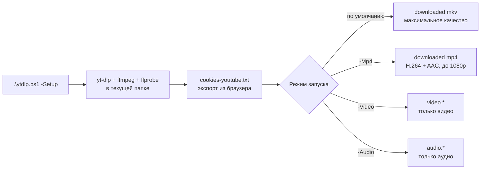

<div align="center">

# 📥 YTDownload

**Скачивание видео с YouTube в максимальном качестве - одним PowerShell-скриптом**

[](https://github.com/PowerShell/PowerShell)
[](https://github.com/bivlked/YTDownload/releases/latest)
[](https://github.com/bivlked/YTDownload/releases)
[](LICENSE)
[](https://www.microsoft.com/windows)

**Русский** | [English](README.en.md)


</div>

Один скрипт `ytdlp.ps1` скачивает лучшие доступные видео- и аудиопотоки через [yt-dlp](https://github.com/yt-dlp/yt-dlp), объединяет их через [ffmpeg](https://ffmpeg.org/) без перекодирования и сам устанавливает все компоненты. Ничего не ставится в систему: всё живёт в одной папке.

## 📑 Оглавление

- [Возможности](#-возможности)
- [Требования](#-требования)
- [Быстрый старт](#-быстрый-старт)
- [Как это работает](#-как-это-работает)
- [Режимы работы](#-режимы-работы)
- [Коды возврата](#-коды-возврата)
- [Поддерживаемые ссылки](#-поддерживаемые-ссылки)
- [Проверки перед скачиванием](#-проверки-перед-скачиванием)
- [Обновление компонентов](#-обновление-компонентов)
- [Частые вопросы (FAQ)](#-частые-вопросы-faq)
- [Устранение неполадок](#%EF%B8%8F-устранение-неполадок)
- [Структура файлов](#-структура-файлов)
- [Технические детали](#%EF%B8%8F-технические-детали)
- [Безопасность](#-безопасность)
- [Вклад в проект](#-вклад-в-проект)
- [История изменений](#-история-изменений)
- [Лицензия](#-лицензия)
- [Дисклеймер](#%EF%B8%8F-дисклеймер)

## ✨ Возможности

- ✅ **Максимальное качество** - лучшие доступные видео- и аудиопотоки (VP9/AV1 + Opus, включая 4K и 8K) без перекодирования
- 🚀 **Автоматическая установка** - `-Setup` скачивает yt-dlp, ffmpeg и ffprobe одной командой
- 🔒 **Безопасность** - работает только в текущей папке, не изменяет систему, изолирован от чужих конфигов
- 🎯 **Простота** - один файл, единственная системная зависимость: PowerShell 7.2+
- 📦 **Портативность** - вся установка переносится копированием папки
- 🍪 **Поддержка cookies** - обход проверки «not a bot» от YouTube
- ⚡ **Умные проверки** - валидация URL и здоровья cookies до начала скачивания
- 🎨 **Понятный вывод** - цветные сообщения с ясной диагностикой и подсказками

## 📋 Требования

- **Windows 10/11**
- **PowerShell 7.2+** ([скачать](https://github.com/PowerShell/PowerShell/releases/latest))
- **cookies-youtube.txt** - файл cookies для авторизации (см. [Шаг 2](#-шаг-2-настройте-cookies))

Компоненты yt-dlp, ffmpeg и ffprobe скрипт скачает автоматически.

## 🚀 Быстрый старт

**TL;DR для опытных:** скачайте скрипт, разблокируйте, запустите Setup, добавьте cookies:

```powershell
Unblock-File .\ytdlp.ps1
.\ytdlp.ps1 -Setup
# + добавьте cookies-youtube.txt (см. Шаг 2)
.\ytdlp.ps1 "https://youtube.com/watch?v=VIDEO_ID"
```

---

### 📦 Шаг 1: Скачайте и установите

<details>
<summary>Нужен PowerShell 7? Проверьте версию...</summary>

Откройте PowerShell и выполните:

```powershell
$PSVersionTable.PSVersion
```

Если версия ниже 7.2, [скачайте PowerShell 7](https://github.com/PowerShell/PowerShell/releases/latest) (файл `PowerShell-7.x.x-win-x64.msi`).

</details>

**1.** [📥 **Скачайте ytdlp.ps1**](https://github.com/bivlked/YTDownload/releases/latest/download/ytdlp.ps1) в новую папку (например, `C:\YTDownload\`)

**2.** Откройте **PowerShell 7** и выполните:

```powershell
cd C:\YTDownload
Unblock-File .\ytdlp.ps1
.\ytdlp.ps1 -Setup
```

Скрипт автоматически скачает yt-dlp, ffmpeg и ffprobe.

<details>
<summary>❓ Ошибка "not digitally signed" или "scripts is disabled"?</summary>

Windows блокирует скрипты из интернета. Решение:

```powershell
# Вариант 1: Разблокировать файл
Unblock-File .\ytdlp.ps1

# Вариант 2: Через GUI
# ПКМ на файл -> Свойства -> ☑ Разблокировать -> ОК

# Вариант 3: Разрешить все скрипты в текущей сессии
Set-ExecutionPolicy Bypass -Scope Process
```

</details>

---

### 🍪 Шаг 2: Настройте cookies

> ⚠️ **Cookies обязательны** - без файла `cookies-youtube.txt` скрипт не начнёт скачивание.

| Шаг | Действие |
|:---:|----------|
| 1️⃣ | Установите расширение [Get cookies.txt LOCALLY](https://chromewebstore.google.com/detail/get-cookiestxt-locally/cclelndahbckbenkjhflpdbgdldlbecc) |
| 2️⃣ | Откройте **InPrivate/Incognito** окно и войдите в YouTube |
| 3️⃣ | Перейдите на `youtube.com/robots.txt` и экспортируйте cookies |
| 4️⃣ | Сохраните как `cookies-youtube.txt` в папку со скриптом |
| 5️⃣ | **Сразу закройте** InPrivate окно (важно!) |

<details>
<summary>🔄 Cookies перестали работать?</summary>

YouTube периодически ротирует cookies. Просто повторите шаги 2-5 выше.
Ключевой момент: экспортируйте с `youtube.com/robots.txt`, не с главной страницы.

</details>

---

### 🎬 Шаг 3: Скачивайте!

```powershell
# Видео + аудио в максимальном качестве
.\ytdlp.ps1 "https://www.youtube.com/watch?v=VIDEO_ID"

# Только видео (без звука)
.\ytdlp.ps1 -Video "https://www.youtube.com/watch?v=VIDEO_ID"

# Только аудио (без видео)
.\ytdlp.ps1 -Audio "https://www.youtube.com/watch?v=VIDEO_ID"
```

**Готово!** Файлы сохраняются в текущей папке как `downloaded.mkv`, `video.webm`, `audio.webm` и т.д.

## 🧭 Как это работает



Перед каждым скачиванием скрипт проверяет здоровье cookies, валидирует URL и только затем запускает yt-dlp с проверенными флагами. После скачивания честно проверяет результат: код возврата 0 без созданного файла не считается успехом.

## 📖 Режимы работы

| Режим | Команда | Что делает | Формат |
|-------|---------|------------|--------|
| **Полное видео** | `.\ytdlp.ps1 "URL"` | Видео + аудио | `.mkv` |
| **MP4 формат** | `.\ytdlp.ps1 -Mp4 "URL"` | Видео + аудио (H.264, до 1080p) | `.mp4` |
| **Только видео** | `.\ytdlp.ps1 -Video "URL"` | Видео без звука | `.webm`/`.mp4` |
| **Только аудио** | `.\ytdlp.ps1 -Audio "URL"` | Аудио без видео | `.webm`/`.m4a` |
| **Установка** | `.\ytdlp.ps1 -Setup [-Force]` | Скачивает компоненты | - |
| **Диагностика** | `.\ytdlp.ps1` | Статус компонентов и справка | - |

---

### 📦 Режим установки: `-Setup`

Автоматически скачивает и устанавливает все необходимые компоненты в текущую папку.

```powershell
# Первичная установка
.\ytdlp.ps1 -Setup

# Принудительное обновление (перезапись существующих файлов)
.\ytdlp.ps1 -Setup -Force
```

**Что делает:**

- Скачивает последние стабильные версии yt-dlp, ffmpeg, ffprobe
- Проверяет актуальность версии yt-dlp через GitHub API
- Показывает версии установленных компонентов
- Отказывается работать, если имя компонента занято папкой (защита от «тихой» неудачной установки)
- Напоминает о необходимости добавить cookies

### 📥 Режим «Полное видео» (по умолчанию)

Скачивает видео и аудио в максимальном качестве и объединяет их в один файл MKV без перекодирования.

**Формат выбора потоков:** `bv*+251/bv*+ba/b`

- Лучшее видео + аудио формат 251 (Opus)
- Если 251 недоступен - лучшее видео + лучшее аудио
- Fallback на лучший комбинированный поток

**Имена файлов:** `downloaded.mkv`, затем `downloaded000.mkv`, `downloaded001.mkv`, ...

### 📼 Режим MP4: `-Mp4`

Для устройств, не поддерживающих MKV/VP9/Opus (некоторые ТВ, старые телефоны).

**Формат выбора потоков:** H.264 (`avc1`) + AAC с ограничением `height<=1080` на **всех** ветках селектора - результат всегда совместимый.

**Имена файлов:** как в полном режиме, но `.mp4`.

### 🎬 Режим «Только видео»: `-Video`

**Формат выбора потоков:** `bv`

- Лучший видеопоток **без аудио** (best video-only)
- Именно `bv`, а не `bv*`: `bv*` мог бы выбрать поток со звуком

**Имена файлов:** `video.webm`, `video.mp4`, ... затем `video001.*`, `video002.*`, ...

### 🎵 Режим «Только аудио»: `-Audio`

**Формат выбора потоков:** `251/ba/b`

- Формат 251 (Opus, обычно лучшее качество на YouTube)
- Если 251 недоступен - лучший аудиопоток (`ba`)
- Если нет отдельного аудио - лучший комбинированный поток (`b`)

**Имена файлов:** `audio.webm`, `audio.m4a`, ... затем `audio001.*`, `audio002.*`, ...

## 🔢 Коды возврата

Скрипт возвращает осмысленные коды - удобно для автоматизации:

| Код | Значение |
|:---:|----------|
| `0` | Успех: файл скачан |
| `2` | Не найдены yt-dlp.exe / ffmpeg.exe (запустите `-Setup`) |
| `3` | Не найден cookies-youtube.txt |
| `4` | Онлайн-проверка cookies не пройдена |
| `5` | URL не прошёл валидацию (не похож на ссылку YouTube) |
| `6` | yt-dlp завершился успешно, но ожидаемый файл не создан или пуст |
| `10` | Неизвестный режим запуска (защитный код, в норме недостижим) |
| другие | Ненулевые коды самого yt-dlp пробрасываются как есть |

> Код `6` возможен только в режимах по умолчанию и `-Mp4` (там имя файла известно заранее). В `-Video`/`-Audio` ненайденный файл даёт предупреждение при коде `0`.

## 🔗 Поддерживаемые ссылки

- ✅ `https://www.youtube.com/watch?v=VIDEO_ID`
- ✅ `https://youtu.be/VIDEO_ID`
- ✅ `https://www.youtube.com/shorts/VIDEO_ID`
- ✅ `https://www.youtube.com/live/VIDEO_ID`
- ✅ `https://www.youtube.com/clip/CLIP_ID`
- ✅ `https://www.youtube.com/embed/VIDEO_ID`
- ✅ `https://www.youtube.com/@Channel/live`
- ✅ `https://www.youtube.com/@Channel/shorts/VIDEO_ID`
- ✅ `https://m.youtube.com/watch?v=VIDEO_ID`
- ✅ `https://music.youtube.com/watch?v=VIDEO_ID`
- ✅ `https://www.youtube-nocookie.com/embed/VIDEO_ID`

**Важно:** скрипт НЕ скачивает плейлисты целиком (включён `--no-playlist`). Для плейлиста указывайте URL каждого видео отдельно.

## 🔍 Проверки перед скачиванием

1. **Компоненты**: обязательны `yt-dlp.exe`, `ffmpeg.exe`, `cookies-youtube.txt`; `ffprobe.exe` опционален (предупреждение вместо блокировки). Папка с именем компонента не считается установленным компонентом.
2. **Локальная проверка cookies**: формат Netscape, наличие cookie-строк, ключевые cookies YouTube (SID, SAPISID, HSID и т.д.), срок действия.
3. **Валидация URL**: проверка домена и пути; при ошибке - примеры правильных форматов.
4. **Онлайн-проверка cookies** (условная): выполняется только если локальная проверка нашла проблемы. Быстрая, без скачивания медиа (`--skip-download`). Если ошибка похожа на проблему cookies - показывает инструкцию по их обновлению; иначе честно перечисляет другие возможные причины (видео удалено/приватное, устаревший yt-dlp).

## 🔄 Обновление компонентов

```powershell
.\ytdlp.ps1 -Setup -Force
```

Скрипт покажет текущую и последнюю версию yt-dlp и предупредит, если доступно обновление. **Держите yt-dlp свежим**: устаревшая версия - самая частая причина ошибок скачивания (подробности в [гайде по 4K](docs/4k-po-token.md)).

## ❓ Частые вопросы (FAQ)

### Нужна ли платная подписка YouTube Premium для скачивания в 4K?

Нет. 4K и 8K доступны без подписки: они отдаются в DASH-потоках (VP9/AV1), которые скрипт скачивает в режиме по умолчанию. Если вместо 4K приходит 1080p - см. [устранение неполадок](#%EF%B8%8F-устранение-неполадок).

### Почему файл получается MKV, а не MP4?

Лучшее качество YouTube - это кодеки VP9/AV1 + Opus, а контейнер MP4 их не поддерживает. MKV принимает любые кодеки и позволяет объединить потоки **без перекодирования** (без потери качества). MKV открывается VLC, MPC-HC и большинством современных плееров. Нужен именно MP4 - используйте `-Mp4` (H.264 + AAC, до 1080p).

### Почему cookies обязательны?

YouTube показывает проверку «Sign in to confirm you're not a bot» для анонимных запросов. Cookies залогиненной сессии позволяют yt-dlp скачивать без этой блокировки. Файл остаётся на вашем диске и никуда не передаётся, кроме самого YouTube.

### Можно ли скачать плейлист целиком?

Нет, это осознанное ограничение: скрипт всегда передаёт `--no-playlist`, чтобы случайная ссылка «видео внутри плейлиста» не запустила скачивание сотен роликов. Скачивайте каждое видео отдельной командой.

### У меня настроен yt-dlp.conf - скрипт его использует?

Нет. Все вызовы yt-dlp идут с `--ignore-config`: поведение скрипта всегда предсказуемо и не зависит от внешних настроек (включая опасные, вроде `--exec`). Прокси и лимиты скорости из `yt-dlp.conf` применяться не будут.

### Какое время изменения (mtime) у скачанных файлов?

В режимах `-Video`/`-Audio` - момент скачивания (передаётся `--no-mtime`): на этом строится определение имени результата. В режимах по умолчанию и `-Mp4` время зависит от версии yt-dlp: старые версии ставили дату публикации ролика, свежие - момент скачивания.

## 🛠️ Устранение неполадок

<details>
<summary><b>📺 Приходит 1080p вместо 4K, или загрузка обрывается на HTTP 403</b></summary>

**Причина:** чаще всего yt-dlp отстал от изменений защиты YouTube - 4K закрыто за PO Token / SABR, и устаревшая версия падает в `403 Forbidden` (обычно на ~90 МБ) либо отдаёт только 1080p. Пример: версия `2026.08.19` убрала клиент `android_vr`, из-за которого 4K обрывался в 403.

**Решение по порядку:**

1. Обновите yt-dlp: `.\ytdlp.ps1 -Setup -Force` - решает большинство случаев.
2. Качайте в **дефолтном режиме** (`.\ytdlp.ps1 "URL"`), а не `-Mp4` (тот ограничен 1080p).
3. Проверьте, что у ролика есть 4K: `.\yt-dlp.exe -F "URL"` (ищите строки `2160`).
4. Если 403 не уходит - настройте локальный PO Token провайдер (bgutil).

📖 Подробная инструкция со всеми шагами: [docs/4k-po-token.md](docs/4k-po-token.md)

</details>

<details>
<summary><b>🍪 Проблемы с cookies</b> - "Sign in to confirm you're not a bot", "cookies rotated"</summary>

**Причина:** cookies отсутствуют, устарели или ротированы YouTube.

**Решение:** экспортируйте свежие cookies:

1. Откройте **InPrivate/Incognito** окно -> войдите в YouTube
2. Перейдите на `youtube.com/robots.txt` -> экспортируйте cookies
3. Сохраните как `cookies-youtube.txt` -> **сразу закройте** InPrivate окно

> 💡 Всегда экспортируйте с `/robots.txt`, не с главной страницы!

</details>

<details>
<summary><b>🔒 Скрипт не запускается</b> - "not digitally signed", "scripts is disabled"</summary>

**Причина:** Windows блокирует скрипты из интернета.

**Решение:**

```powershell
# Способ 1: Разблокировать файл
Unblock-File .\ytdlp.ps1

# Способ 2: Через GUI
# ПКМ на файл -> Свойства -> ☑ Разблокировать -> ОК

# Способ 3: Разрешить в текущей сессии
Set-ExecutionPolicy Bypass -Scope Process
```

</details>

<details>
<summary><b>⚡ Старая версия PowerShell</b> - странные ошибки, "не распознано имя cmdlet"</summary>

**Причина:** используется Windows PowerShell 5.x вместо PowerShell 7.2+.

**Проверка:** `$PSVersionTable.PSVersion` - должно быть 7.2+

**Решение:**

1. [Скачайте PowerShell 7](https://github.com/PowerShell/PowerShell/releases/latest)
2. Запускайте через **pwsh.exe**, не powershell.exe
3. В Windows Terminal выберите профиль "PowerShell" (не "Windows PowerShell")

</details>

<details>
<summary><b>📺 Качество ниже ожидаемого</b></summary>

**Возможные причины:**

- Cookies не работают - обновите их
- Видео недоступно в высоком качестве в вашем регионе
- Используется `-Mp4` - он ограничен 1080p

**Проверка:** откройте видео в браузере и посмотрите доступные качества.

</details>

<details>
<summary><b>😀 Эмодзи отображаются некорректно</b></summary>

**Причина:** старый терминал или кодировка.

**Решение:**

- Используйте [Windows Terminal](https://aka.ms/terminal)
- Или PowerShell 7.2+ напрямую (не Git Bash)

</details>

## 📁 Структура файлов

После установки в папке будут следующие файлы:

```text
📁 YourFolder/
├── 📄 ytdlp.ps1              # Основной скрипт
├── 🔧 yt-dlp.exe             # Загрузчик видео (~18 MB)
├── 🔧 ffmpeg.exe             # Инструмент обработки видео (~100-200 MB)
├── 🔧 ffprobe.exe            # Анализатор медиа (~2-10 MB)
├── 🍪 cookies-youtube.txt    # Ваши cookies для YouTube
├── 📥 downloaded.mkv         # Скачанные видео (пример)
└── 📥 downloaded000.mkv      # Последующие скачивания
```

**Важно:** все файлы остаются в этой папке. Скрипт НЕ устанавливает ничего в систему!

## ⚙️ Технические детали

### Форматные селекторы yt-dlp

```text
Полное видео (MKV):  bv*+251/bv*+ba/b
Полное видео (MP4):  bv*[vcodec^=avc1][height<=1080]+140/bv*[vcodec^=avc1][height<=1080]+ba[ext=m4a]/b[ext=mp4][vcodec^=avc1][height<=1080]
Только видео:        bv
Только аудио:        251/ba/b
```

Где:

- `bv*` - best video (формат, **содержащий** видео; может включать аудио)
- `bv` - best video-only (видео **без** аудио)
- `ba` - best audio (лучшее аудио; алиас `bestaudio`)
- `b` - best (лучший комбинированный поток видео+аудио)
- `251` - формат 251 (Opus, обычно высокое качество)
- `140` - формат 140 (AAC 128k, для MP4)
- `[height<=1080]` - ограничение разрешения для совместимости MP4
- `/` - fallback (если первый вариант недоступен)

Справочник: [документация yt-dlp по выбору форматов](https://github.com/yt-dlp/yt-dlp#format-selection).

### Ключевые флаги yt-dlp

| Флаг | Зачем |
|------|-------|
| `--ignore-config` | Изоляция от личных конфигов yt-dlp: предсказуемое поведение |
| `--no-playlist` | Никогда не скачивать плейлист по ссылке на видео из него |
| `--no-mtime` | Режимы `-Video`/`-Audio`: время файла = момент скачивания, а не дата публикации |
| `--merge-output-format` | Контейнер результата (mkv/mp4) без перекодирования |
| `--ffmpeg-location` | Используется ffmpeg из папки скрипта, не системный |

## 🔐 Безопасность

Скрипт спроектирован с акцентом на безопасность:

- ✅ Работает **только** в текущей папке (не трогает систему)
- ✅ Не перезаписывает файлы: для каждого скачивания подбирается свободное имя
- ✅ Проверяет размер скачанных компонентов в режиме `-Setup` (защита от неполных загрузок)
- ✅ Не скачивает плейлисты целиком (флаг `--no-playlist`)
- ✅ Изолирован от личных конфигов yt-dlp (флаг `--ignore-config`): чужой `yt-dlp.conf` не может незаметно изменить поведение
- ✅ Валидирует URL перед запуском yt-dlp
- ✅ Использует `Set-StrictMode -Version Latest`
- ✅ Честно сообщает об ошибках: «успех» без созданного файла невозможен

О найденной уязвимости сообщите приватно - см. [SECURITY.md](SECURITY.md).

## 🤝 Вклад в проект

Нашли баг или хотите предложить улучшение? Создайте [Issue](https://github.com/bivlked/YTDownload/issues/new/choose) или Pull Request. Что приложить к сообщению о баге и как оформить PR - в [CONTRIBUTING.md](CONTRIBUTING.md).

## 📋 История изменений

Все версии и изменения описаны в [CHANGELOG.md](CHANGELOG.md).

## 📜 Лицензия

[MIT License](LICENSE) - используйте свободно, на свой риск.

## ⚠️ Дисклеймер

Этот скрипт предназначен для личного использования. Убедитесь, что скачивание видео не нарушает авторские права и условия использования YouTube.

---

<div align="center">

**Автор:** [bivlked](https://github.com/bivlked) · **Репозиторий:** [YTDownload](https://github.com/bivlked/YTDownload)

Если скрипт оказался полезным - поставьте ⭐

[⬆ Наверх](#-ytdownload)

</div>
